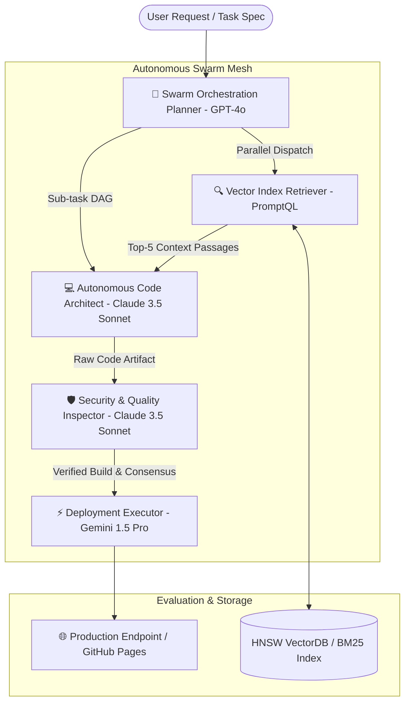

# ⚡ AgenticFlow AI | Autonomous Multi-Agent Orchestration & Prompt Engineering Studio

[](https://gelivisasi.github.io/agentic-flow-ai)
[](https://luma.com/unicornsummit)
[](https://github.com/gelivisasi)
[](LICENSE)

> **AgenticFlow AI** is a state-of-the-art, visual multi-agent workflow orchestrator, vector RAG index inspector, and real-time LLM prompt optimization studio built specifically for high-throughput AI engineering teams.

---

## 🚀 Live Product Demo & Repository
- **Live Deployed Product URL**: [https://gelivisasi.github.io/agentic-flow-ai](https://gelivisasi.github.io/agentic-flow-ai)
- **GitHub Profile**: [@gelivisasi](https://github.com/gelivisasi)
- **Source Code Repository**: [https://github.com/gelivisasi/agentic-flow-ai](https://github.com/gelivisasi/agentic-flow-ai)

---

## 🏛️ System Architecture



---

## Key Features

1. **Visual Multi-Agent DAG Topology Canvas**:
   - Drag, configure, and connect specialized agent personas (Planner, Retriever, Coder, Critic, Executor).
   - Real-time simulation of inter-agent message passing, token usage tracking, and latency measurements.

2. **Real-time Swarm Execution Stream Trace**:
   - Step-by-step reasoning log terminal showing token consumption, model response times, and consensus verification.

3. **Multi-LLM Prompt Engineering Lab**:
   - Side-by-side prompt testing across **OpenAI GPT-4o**, **Anthropic Claude 3.5 Sonnet**, **PromptQL**, **Google Gemini 1.5 Pro**, and **Llama 3 70B**.
   - AI-powered prompt auto-refiner and token counter.

4. **Vector RAG & Embeddings Inspector**:
   - Interactive document chunking visualizer (Recursive Character Splitter, Fixed Window, Semantic Markdown).
   - Real-time cosine similarity search query inspector.

5. **LLM SLA Benchmarks & Production Spec Exporter**:
   - Export full agent DAG topologies into standard JSON/YAML specifications compatible with **LangChain**, **AutoGen**, **CrewAI**, and **PromptQL SDK**.

---

## 🛠️ Quickstart & Local Setup

### Prerequisites
- Node.js >= 18.0.0
- npm >= 9.0.0

### Installation
```bash
# Clone the repository
git clone https://github.com/gelivisasi/agentic-flow-ai.git

# Navigate to project directory
cd agentic-flow-ai

# Install dependencies
npm install

# Start development server
npm run dev
```

### Production Build
```bash
# Typecheck and build static distribution bundle
npm run build

# Preview static production build locally
npm run preview
```

---

## 🌐 Deployment to GitHub Pages

This project is configured for automated build and static deployment to GitHub Pages via `gh-pages`:

```bash
# Build & deploy dist folder to gh-pages branch
npm run deploy
```

---

## 📜 License
Licensed under the [MIT License](LICENSE). Built for the **Unicorn AI Summit 2026** applicant portfolio.
